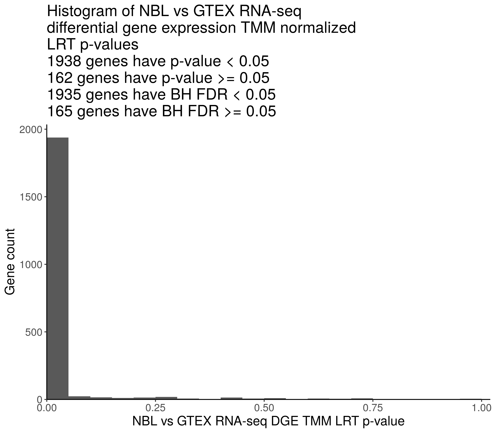
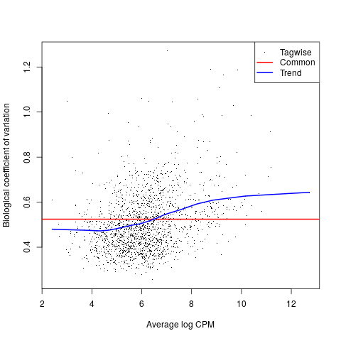

## Identify stably expressed housekeeping genes for batch correction

**Module authors:** Yuanchao Zhang ([@logstar](https://github.com/logstar))

### Purpose

Identify of stably expressed housekeeping genes for batch correction.

### Methods

1. Merge PBTA, GTEx, TARGET and TCGA RSEM expected read counts.
   1. Matched `gtex_target_tcga-gene-counts-rsem-expected_count-collapsed.rds` column names with the mapping files shared by [@komalsrathi](https://github.com/komalsrathi) at <https://github.com/PediatricOpenTargets/ticket-tracker/issues/22#issuecomment-854901528>.
   2. Removed duplicated samples. Some TCGA `sample_barcode`s are mapped to multiple `sample_id`s, and some of their expected count sums are different in `gtex_target_tcga-gene-counts-rsem-expected_count-collapsed.rds`. Keep one of the duplicated samples that have the same RESM expected count.
   3. Use PBTA `gene-counts-rsem-expected_count-collapsed.rds` column names as both `sample_barcode` and `sample_id` for consitency.
   4. Find the histologies of the samples by matching their `sample_barcode`s with the `Kids_First_Biospecimen_ID`s in `histologies.tsv`.
2. Run differential gene expression (DGE) analysis using edgeR TMM normalization and likelihood ratio test on housekeeping genes.

### Results

#### NBL vs GTEx

The DGE result table is at `results/tmm_normalized/NBL_vs_GTEX_dge_lrt_res.csv`, order by p-values from high to low.





For the 30 housekeeping genes that have the highest p-values, the TMM normalized CPM boxplots are at `plots/tmm_normalized/stably_exp_hk_gene_norm_cnt_boxplot`.

### Usage

1. Change working directory to local OpenPBTA-analysis.
2. Download data using bash download-data.sh. Make sure the following files are downloaded:
   - histologies.tsv
   - gene-counts-rsem-expected_count-collapsed.rds
   - gtex_target_tcga-gene-counts-rsem-expected_count-collapsed.rds
3. Run this analysis module in the continuous integration (CI) docker image using `./scripts/run_in_ci.sh bash analyses/rna-seq-stably-expressed-housekeeping-genes/run-rna-seq-identify-bc-sehgs.sh`.

### Module structure

```text
.
├── 01-prepare-data.R
├── 02-identify-stably-expressed-housekeeping-genes.R
├── README.md
├── input
│   ├── Housekeeping_GenesHuman.csv
│   ├── gtex_mapping.txt
│   ├── target_mapping.txt
│   └── tcga_mapping.txt
├── plots
│   └── tmm_normalized
│       ├── NBL_vs_GTEX_dge_lrt_pvals_histogram.png
│       ├── estimated_dispersions.png
│       └── stably_exp_hk_gene_norm_cnt_boxplot/*.png
├── results
│   └── tmm_normalized
│       └── NBL_vs_GTEX_dge_lrt_res.csv
└── run-rna-seq-identify-bc-sehgs.sh
```

### Analysis scripts

#### 01-prepare-data.R

This script cleans up data for DGE analysis.

Usage:

```bash
Rscript --vanilla '01-prepare-data.R'
```

Input:

- `../../data/histologies.tsv`
- `../../data/gene-counts-rsem-expected_count-collapsed.rds`
- `../../data/gtex_target_tcga-gene-counts-rsem-expected_count-collapsed.rds`

Output:

- `../../scratch/pbta_kf_gtex_target_tcga_rsem_expected_cnt_df.rds`
- `../../scratch/pbta_kf_gtex_target_tcga_histology_df.rds`

#### 02-identify-stably-expressed-housekeeping-genes.R

This script runs edgeR DGE analysis on housekeeping genes.

Usage:

```bash
Rscript --vanilla '02-identify-stably-expressed-housekeeping-genes.R'
```

Input:

- `../../scratch/pbta_kf_gtex_target_tcga_rsem_expected_cnt_df.rds`
- `../../scratch/pbta_kf_gtex_target_tcga_histology_df.rds`

Output:

- `results/tmm_normalized/NBL_vs_GTEX_dge_lrt_res.csv`: NBL vs GTEx DGE result table.
- `plots/tmm_normalized`: NBL vs GTEx DGE plots.
